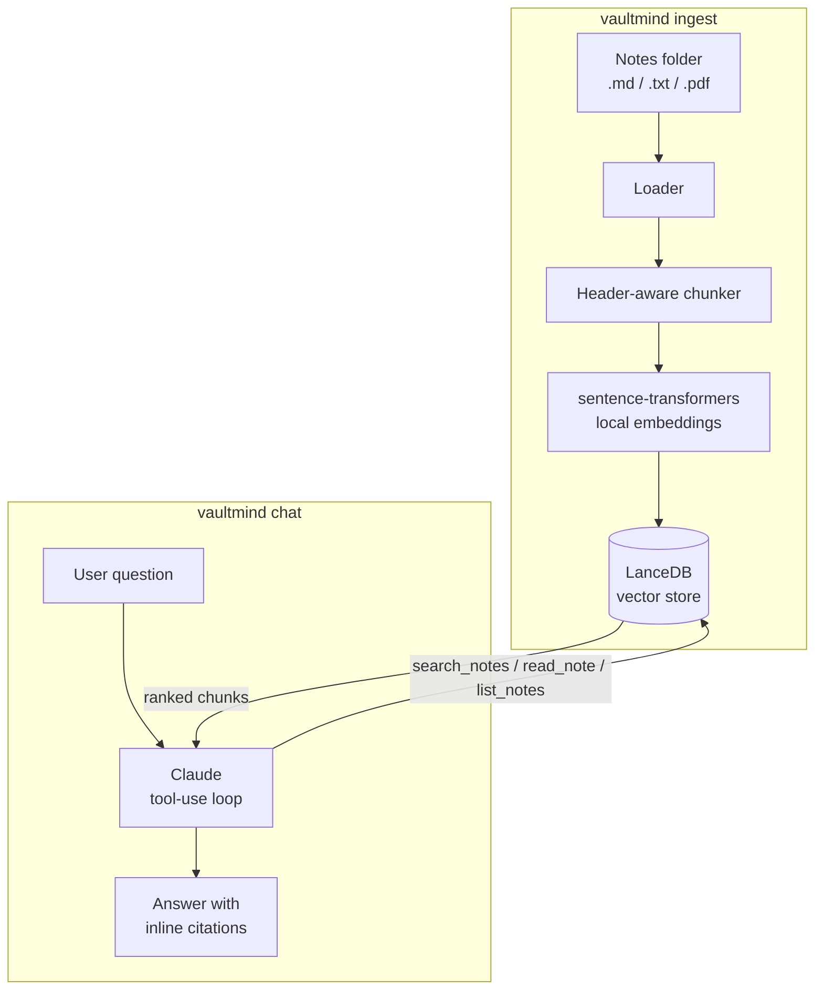

# vaultmind

**An agentic RAG assistant that chats with your own notes.**

Point it at a folder of Markdown, text, or PDF notes and it becomes a chat
assistant that knows what you've written — searching your notes when
relevant, reading the full note when a snippet isn't enough, and always
citing which note an answer came from. Nothing leaves your machine except
the final chat request to Claude.

```
you> what did I decide about LanceDB vs a hosted vector db?
  -> search_notes('vector database choice')
vaultmind> You chose LanceDB because it's embedded — no server to run, just
a directory on disk — which fits a personal tool that should work offline.
[rag-architecture.md > Vector store choice]
```

## Why this exists

Most "chat with your docs" demos are a thin wrapper: embed everything,
stuff the top-k chunks into a prompt, done. vaultmind is built as a proper
**agent**, not a fixed pipeline:

- The model *decides* whether a question needs your notes at all — "what's
  a transformer?" shouldn't trigger a vault search, but "what did I decide
  about the API design?" should.
- It can go **multi-hop**: search, decide the top result isn't enough
  context, and call `read_note` to pull the whole document.
- Every note-derived answer is **cited inline** — `[path > heading]` — so
  you can verify it and jump back to the source.
- Retrieval quality is **measured, not assumed**: a checked-in eval set
  (`tests/eval/`) runs real questions against the real pipeline and reports
  a hit-rate, so a chunking or embedding-model change that quietly breaks
  retrieval gets caught in CI instead of in production.

## Architecture



| Layer | Choice | Why |
|---|---|---|
| Vector store | [LanceDB](https://lancedb.com) | Embedded — a directory on disk, no server, works offline |
| Embeddings | `sentence-transformers` (`all-MiniLM-L6-v2`), local | No second API key to manage; free to run at any volume |
| Chunking | Markdown header-aware, word-window fallback with overlap | Keeps a chunk from straddling two unrelated sections |
| Agent loop | Claude API, [tool use](https://platform.claude.com/docs/en/agents-and-tools/tool-use/overview) | The model decides *when* to retrieve, not a fixed retrieve-then-generate pipeline |
| CLI | [Typer](https://typer.tiangolo.com/) + [Rich](https://rich.readthedocs.io/) | Small, typed, pleasant to read |

## Quickstart

```bash
pip install -e ".[dev]"
export ANTHROPIC_API_KEY="sk-ant-..."

vaultmind ingest ./my-notes      # index a folder of notes (safe to re-run after edits)
vaultmind chat ./my-notes        # interactive chat
vaultmind ask ./my-notes "what did I write about X?"   # one-shot, scriptable
```

Try it against the sample vault checked into this repo:

```bash
vaultmind ingest examples/sample_vault
vaultmind ask examples/sample_vault "what did we decide about the mobile app rewrite?"
```

By default it uses `claude-opus-5`. For a personal tool you run many times a
day, a cheaper model is often the better trade-off — override it with:

```bash
export VAULTMIND_MODEL=claude-sonnet-5   # or claude-haiku-4-5 for the cheapest/fastest option
export VAULTMIND_EFFORT=low              # low | medium | high | xhigh | max
```

## Testing

```bash
pytest -q          # 29 tests: chunking, vector store, tools, CLI, retrieval eval
ruff check src tests
```

None of the tests make live API calls — CLI/agent tests stub out the
Claude client — so the suite runs in CI with no API key and no cost. The
retrieval eval (`tests/eval/`) does run the real embedding model and vector
store against a small checked-in QA set, currently at **7/7 (100%) hit@3**
on the sample vault.

## Project layout

```
src/vaultmind/
├── config.py           # Settings (vault path, model, effort, chunk size...)
├── cli.py              # ingest / chat / ask commands
├── ingest/
│   ├── loader.py       # walks a vault, reads .md/.txt/.pdf
│   ├── chunker.py       # header-aware + overlapping word-window chunking
│   ├── embedder.py      # sentence-transformers wrapper
│   └── store.py         # LanceDB wrapper
└── agent/
    ├── tools.py         # search_notes / read_note / list_notes
    └── core.py          # the tool-use loop
tests/
├── test_chunker.py, test_store.py, test_tools.py, test_cli.py
└── eval/                # retrieval quality QA set + harness
```

## Limitations / roadmap

- Single-user, local-only — no multi-tenant or sync story, by design.
- Re-ingesting fully rebuilds the index; incremental updates on file-change
  would be the natural next step for a larger vault.
- No reranking step — LanceDB's vector search alone is doing retrieval
  ranking. A cross-encoder rerank pass would likely lift hit-rate further
  on larger, noisier vaults.

## License

MIT — see [LICENSE](LICENSE).
